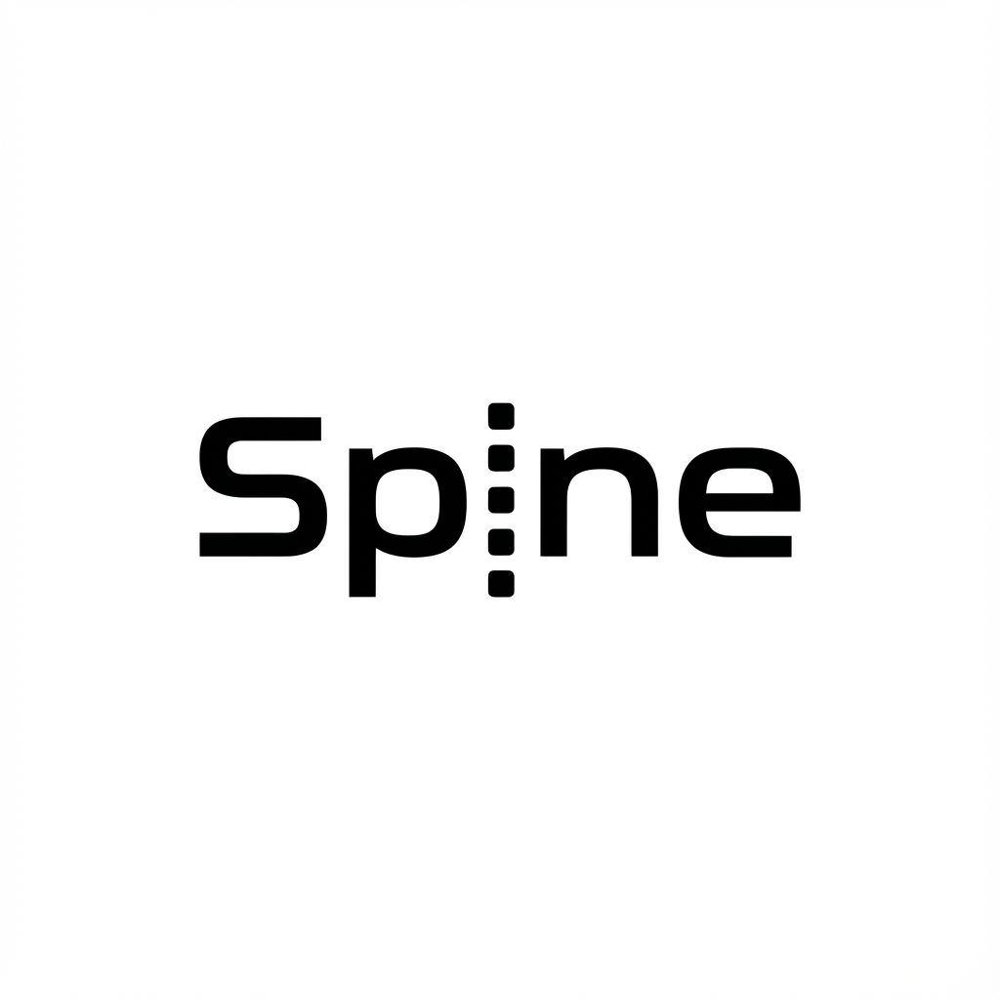

  한국어 | <a href="README.en.md">English</a>

# 🦴 Spine

  

**Spine는 실행 흐름이 드러나는 백엔드 프레임워크입니다.**  
요청이 어떻게 해석되고 실행되는지 숨기지 않습니다.

## 핵심 아이디어

- 실행 순서와 책임을 코드 구조로 고정합니다
- 메서드 시그니처가 API 계약입니다
- `path.*`, `query.*`, `httperr.*` 의미 타입을 사용합니다

## 링크

- 공식 사이트: https://spine.na2ru2.me/ko/
- 예제 프로젝트: https://github.com/NARUBROWN/spine-user-demo

---

## License

MIT
